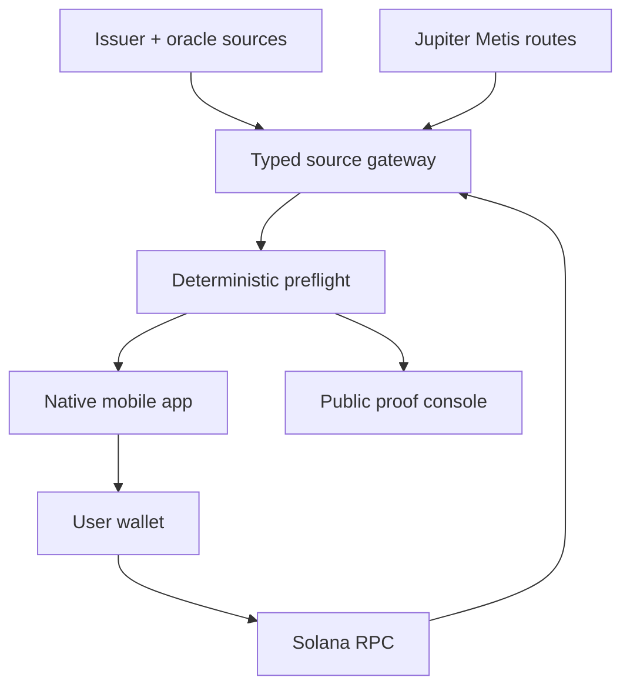

# System Architecture

## Architecture principle

Seametry keeps facts, derivations and user actions separate.

- Providers publish observations.
- The gateway verifies and normalizes them.
- The preflight engine derives deterministic product states.
- The mobile app explains those states and collects explicit approval.
- The wallet signs.
- Solana settles.

No adapter is allowed to return a naked `price: number`. Every observation carries identity, denomination, timestamp, source, methodology, market status, verification state and freshness.

## Topology



## Runtime components

### Native application

`apps/mobile` uses Expo and React Native with a development build. It owns navigation, watchlists, user thresholds, notifications, biometric/app-lock integration if time permits, wallet handoff, local receipts and offline fixture replay.

It never contains provider secrets or a private signing key.

### Public proof console

`apps/web` renders the same preflight envelope using shared domain and UI packages. Its routes are deliberately narrow:

- `/` product and proof summary;
- `/live/:symbol` read-only live context;
- `/replay/unhx-2026-09-12` synchronized evidence replay;
- `/receipt/:signature` public redacted receipt;
- `/builds` native build and repository links.

### Source gateway

`apps/api` protects API credentials and standardizes upstream responses. It exposes:

- `GET /v1/instruments/:symbol`
- `GET /v1/context/:symbol`
- `GET /v1/quotes/:symbol?side=&amount=&dex=`
- `POST /v1/preflight`
- `POST /v1/transactions/build`
- `GET /v1/transactions/:signature/receipt`
- `POST /v1/devices/subscriptions`

Responses include a schema version and server observation time. Short caching is source-specific and never hides the original source timestamp.

### Shared preflight engine

`packages/preflight` is a pure TypeScript function:

```ts
type Preflight = (
  instrument: InstrumentState,
  observations: ReferenceObservation[],
  quote: ExecutableQuote,
  policy: PolicyVersion,
  now: string,
) => PreflightResult;
```

It performs no network requests, stores no state and returns no personalized recommendation.

## Canonical envelope

```ts
interface MarketContextEnvelope {
  schemaVersion: "1.0";
  capturedAt: string;
  instrument: InstrumentState;
  observations: ReferenceObservation[];
  quote: ExecutableQuote | null;
  sourceHealth: SourceHealth[];
  preflight: PreflightResult;
}

interface ReferenceObservation {
  source: "xstocks" | "chainlink" | "stork";
  instrumentId: string;
  value: string | null;
  quoteCurrency: string;
  observedAt: string | null;
  receivedAt: string;
  marketStatus: string | null;
  methodology: string;
  verification: "verified" | "unverified" | "failed" | "not-supported";
  freshnessMs: number | null;
  unavailableReason?: string;
}

interface ExecutableQuote {
  provider: "jupiter-metis";
  inputMint: string;
  outputMint: string;
  inAmountRaw: string;
  expectedOutRaw: string;
  minimumOutRaw: string;
  slippageBps: number;
  priceImpactPct: string | null;
  routePlan: RouteLeg[];
  fees: FeeLine[];
  expiresAt: string;
}

interface PreflightResult {
  decision: "ALLOW" | "WARN" | "BLOCK";
  reasonCodes: string[];
  facts: AttributedFact[];
  policyVersion: string;
  inputDigest: string;
}
```

Decimal values remain strings until converted by a decimal library. Raw Token-2022 amounts and multiplier-adjusted display amounts are both retained.

## Quote and execution path

Seametry uses Jupiter Swap V2 Router `/build` with Metis for the inspectable path. It returns raw instructions, a route plan with AMM labels and addresses, expected output and `otherAmountThreshold`. `dexes` and `excludeDexes` enable venue-restricted probes.

The mobile flow:

1. Requests read-only context.
2. Requests a quote for the entered amount.
3. Renders the preflight result.
4. Requires the user to acknowledge active reason codes.
5. Requests a fresh `/build` immediately before signing.
6. Rejects any material change and returns the user to approval.
7. Hands the serialized transaction to the wallet.
8. Submits through the chosen RPC/landing path.
9. Verifies balances and records the receipt.

The default Meta-Aggregator may be added later for best-price comparison. The transparent V1 path uses Metis because the product must expose route composition and maintain transaction control.

## Wallet strategy

Implement a wallet interface with one production adapter first:

```ts
interface MobileWallet {
  connect(): Promise<PublicKey>;
  signTransaction(tx: Uint8Array): Promise<Uint8Array>;
  disconnect(): Promise<void>;
}
```

Phantom mobile deep links provide the first cross-platform handoff with encrypted sessions and a custom redirect back into Seametry. Solana Mobile Wallet Adapter can be added as an Android adapter without changing the product flow.

The app stores opaque wallet sessions in secure native storage. It does not store seed phrases or private keys.

## Receipts

A receipt freezes what the user approved and what settled:

- context digest and policy version;
- instrument and mint;
- every source value and timestamp;
- active reason codes;
- quote creation and expiry;
- expected and minimum output;
- route and fee lines;
- transaction signature;
- settled token deltas;
- settlement slot and time.

Mobile receipts remain local by default and can be exported. The demo receipt can be explicitly published in redacted form for judges.

## Failure behavior

- Provider timeout: return an attributed unavailable observation.
- Verification failure: never silently use the value; mark failed and derive policy.
- Quote mutation before signing: require renewed approval.
- Wallet return failure: preserve unsigned preflight locally and let the user retry.
- Settlement timeout: show pending, poll by signature, and never claim failure until chain status resolves.
- Fixture mode: visibly label replay data and disable execution.

## Minimal dependencies

Every dependency has a product reason:

- Expo/React Native for native iOS and Android delivery;
- a small navigation library;
- native secure storage and notification modules;
- Solana transaction libraries;
- one decimal arithmetic library;
- runtime schema validation;
- provider SDKs only where they implement signature verification correctly;
- a compact TypeScript API and web runtime.

No custom Solana program is required for the first signed swap. Onchain oracle verification becomes necessary only when Seametry's own program consumes the report atomically. V1 verifies reports offchain and displays that scope accurately.

